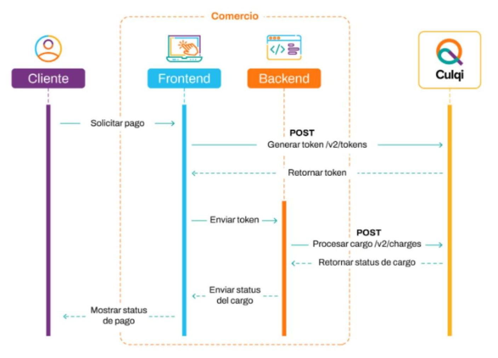

# 
# Recurso Java: pasarela

>El objetivo de este documento es proveer información relacionada del Proyecto que ha sido implementado sobre Java, MySQL y MongoDB.

### 1.  Funcionalidad
>Este proyecto Java tiene como objetivo guardar los datos de las terjetas y responder con un token único.

### 2.  Preparación de ambiente
>Este **proyecto** brinda diversas capacidades a los aplicativos para poder recuperar datos de manera segura y fácil mediante los siguientes pasos:

#### 2.1. MySQL: 
>Programa que es necesario para el funcionamiento y conexión de la aplicación.

##### 2.1.1 Credenciales

| # | Propiedad     | Valor   |
| :----|:-------------:| -----:|
|1| database | test   |
|2| username | root   |
|3| password | root   |
|4| port | 3306   |
|5| host | localhost   |

#### 2.2. MongoDb: 
>Programa que es necesario para el funcionamiento y conexión de la aplicación.

##### 2.2.1 Credenciales

| # | Propiedad     | Valor   |
| :----|:-------------:| -----:|
|1| database | admin   |
|2| port | 27017   |
|3| host | localhost   |

### 3. Pruebas
>Se está compartiendo la colección con el nombre **Culqi.postman_collection.json** para que pueda ser importado en Postman.

|#|Nombre prueba|Descripción|
|:----|:----|:----|
|1|Guardar Data|Enviar el objeto pasarela y recibir el token generado.|
|2|Recuperar data segun el token|Recuperar el objeto pasarela sin información en el campo CVV según el token enviado.|

### 4. Diagrama de Componentes
En este apartado se grafican todos los componentes involucrados en el funcionamiento del recurso.

### 5.  Versiones
En este apartado se detalla un historial de cambios o *changelog* por cada version implementada del recurso.

+ Versión 1.0.0: Esta versión permite enviar y recuperar datos para la tokenización.
